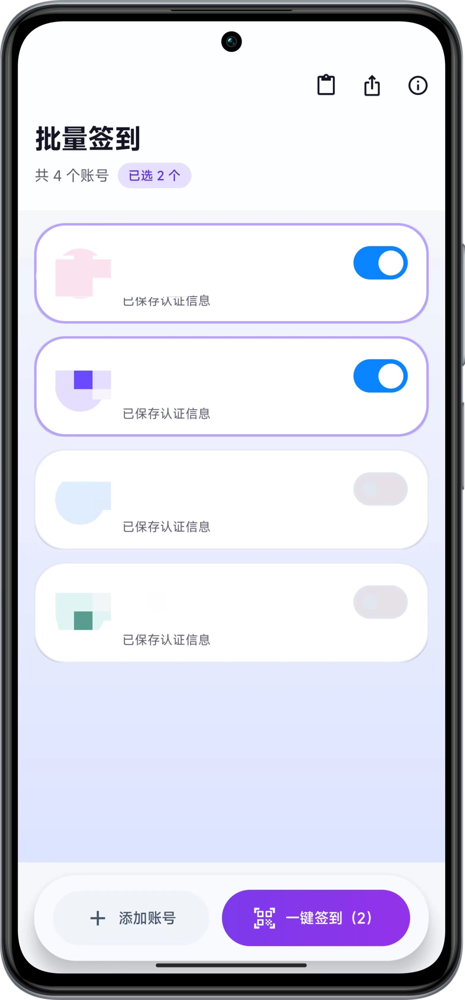
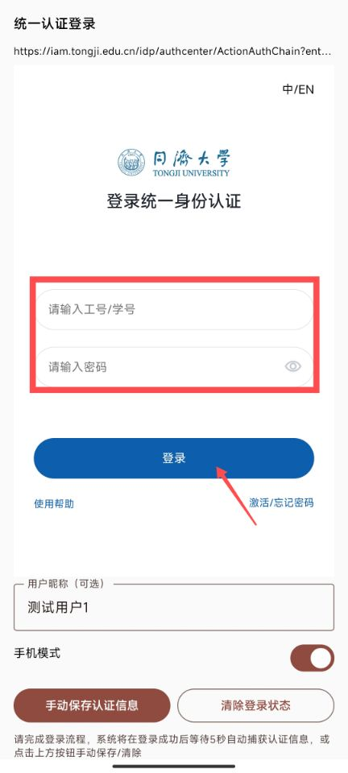
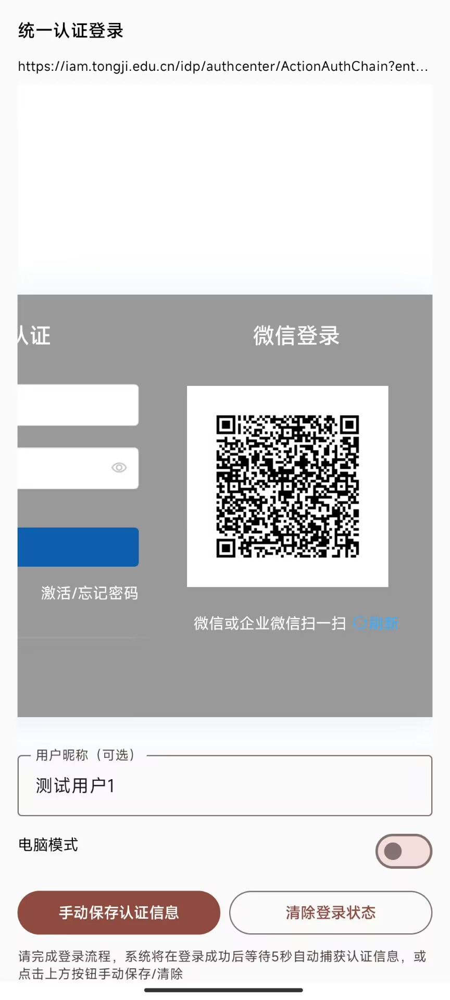

# 同济大学Canvas系统课堂签到助手

一个专为同济大学Canvas系统课堂签到场景设计的Android批量签到应用。

## ✨ 项目简介

本应用实现了多人签到功能：多个用户事先通过统一认证平台登录，然后APP分别拦截并保存好每个用户的认证信息，用这个APP扫描二维码，可以并发完成多个人的签到。

认证信息永久有效，只需获取一次。


## 📖 使用指南
1. 点击左下方 **添加账号**，点击“在线登陆添加”进入统一认证登录页，可一键切换移动/桌面模式（支持微信扫码登录）。
2. 登录成功后等待 5 秒，系统会自动提取认证信息。
3. 回到主界面，在卡片中管理账号，开启需要参与本次签到的用户，点击 **一键签到** 完成批量签到。
4. 如需手动录入 Cookies，使用 添加账号-手动录入Cookies 按钮。

> 右上方支持从剪贴板导入导出用户信息。

## 🆕 最新特性
- 主界面新增进度摘要、滚动动画与批量操作工具栏。
- OAuth2 登录界面提供卡片式提示、分段按钮和实时状态提示。
- 批量签到页拥有状态驱动的卡片、骨架加载动画与可折叠调试 WebView。
- 全新的 ML Kit 扫码器，支持小尺寸/倾斜二维码、手电筒、重新扫描及实时提示。

✅ 新的UI<br>
✅ 优化动画和操作逻辑<br>
✅ 大幅增加二维码识别速度和准确率<br>



---
旧版：
<table>
  <tr>
    <td></td>
    <td></td>
    <td></td>
  </tr>
  <tr>
    <td></td>
    <td></td>
    <td></td>
  </tr>
</table>


## 新增web版：[点击跳转仓库](https://github.com/mmmlllnnn/TongJi_Canvas_Web)

web版又称呆瓜版， 无需安装APP ，

只需要对方在浏览器打开链接,对准二维码完成签到。

需要事先构建自己的专属url链接: 在?后替换为你的认证信息。

```
https://你的域名/index.html?_canvas_middle_session=xxxxxxx

```


在线版访问（自己搭的 不排除某天关停）：[https://handsome.eu.org/cdn_js/index.html?_canvas_middle_session=xxxxxxx](https://handsome.eu.org/cdn_js/index.html?_canvas_middle_session=xxxxxxx)


---

### 应用配置
- **最小SDK**：28 (Android 9.0)
- **目标SDK**：36 (Android 16)

### 权限要求
- `CAMERA`：相机权限，用于二维码扫描
- `INTERNET`：网络权限，用于登录和签到

```
app/src/main/java/com/mln/tongji_canvas/
├── MainActivity.kt              # 主活动，导航控制
├── data/                       # 数据层
│   ├── SessionModels.kt        # 数据模型定义
│   └── SessionRepository.kt    # 数据存储管理
└── ui/                         # 界面层
    ├── MainScreen.kt           # 主界面，用户管理
    ├── OAuth2LoginScreen.kt    # OAuth2登录界面
    ├── EnhancedScannerScreen.kt # 增强扫描界面
    └── BatchSignScreen.kt      # 批量签到界面
```
---
