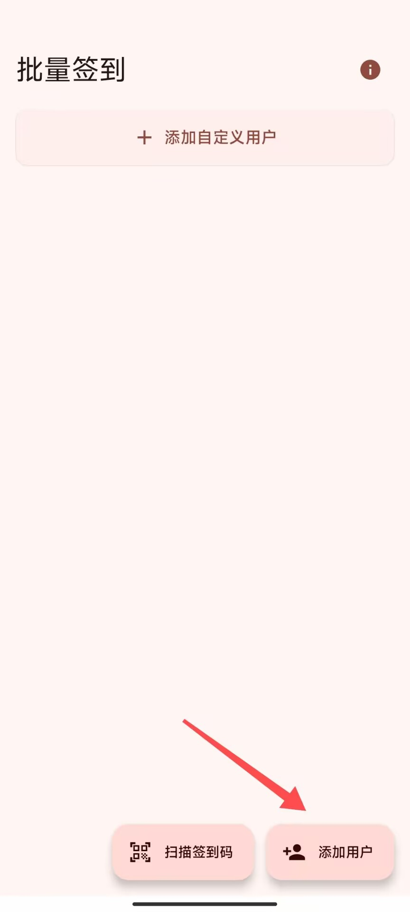

# 同济大学Canvas系统课堂签到助手

一个专为同济大学Canvas系统课堂签到场景设计的Android批量签到应用。

## ✨ 项目简介

本应用实现了多人签到功能：多个用户事先通过统一认证平台登录，然后APP分别拦截并保存好每个用户的认证信息，用这个APP扫描二维码，可以依次替换认证信息打开，完成多个人的签到。


## 📖 使用指南
1.点击 “添加用户”，进入统一认证登录页。可切换 手机版/电脑版，电脑版支持微信扫码登录。

2.登录后会跳到一个提示错误的页面，这是正常的。等待 5 秒 系统会自动获取登录信息；若未自动获取，可手动点击 “保存”。

3.返回主界面后，会看到已保存的账号。点击 “扫描签到码”，对准课堂二维码即可自动对已保存的账号进行签到。


拦截到的认证信息永久有效。


<table>
  <tr>
    <td></td>
    <td></td>
    <td></td>
  </tr>
  <tr>
    <td></td>
    <td></td>
    <td></td>
  </tr>
</table>

## 新增web版：[点击跳转仓库](https://github.com/mmmlllnnn/TongJi_Canvas_Web)

web版又称呆瓜版， 无需安装APP ，

只需要对方在浏览器打开链接,对准二维码完成签到。

需要事先构建自己的专属url链接: 在?后替换为你的认证信息。

```
https://你的域名/index.html?_canvas_middle_session=xxxxxxx

```


在线版访问：[https://handsome.eu.org/cdn_js/index.html?_canvas_middle_session=xxxxxxx](https://handsome.eu.org/cdn_js/index.html?_canvas_middle_session=xxxxxxx)


---

### 应用配置
- **最小SDK**：28 (Android 9.0)
- **目标SDK**：36 (Android 16)

### 权限要求
- `CAMERA`：相机权限，用于二维码扫描
- `INTERNET`：网络权限，用于登录和签到

```
app/src/main/java/com/mln/tongji_canvas/
├── MainActivity.kt              # 主活动，导航控制
├── data/                       # 数据层
│   ├── SessionModels.kt        # 数据模型定义
│   └── SessionRepository.kt    # 数据存储管理
└── ui/                         # 界面层
    ├── MainScreen.kt           # 主界面，用户管理
    ├── OAuth2LoginScreen.kt    # OAuth2登录界面
    ├── EnhancedScannerScreen.kt # 增强扫描界面
    └── BatchSignScreen.kt      # 批量签到界面
```
---
